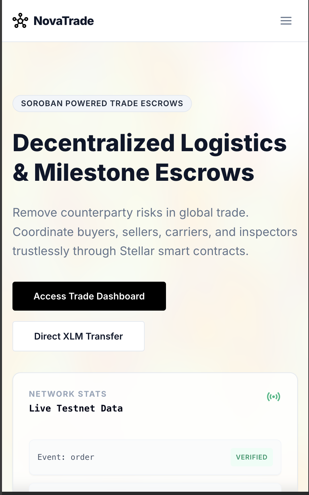
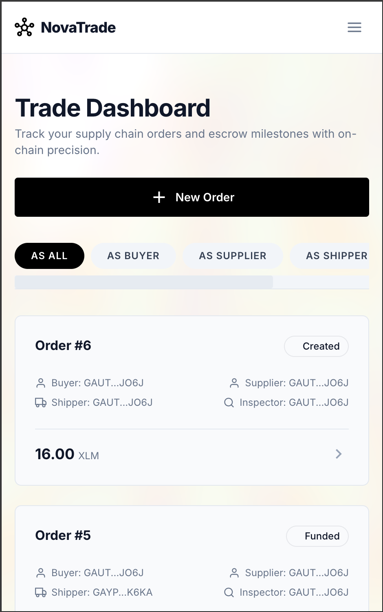
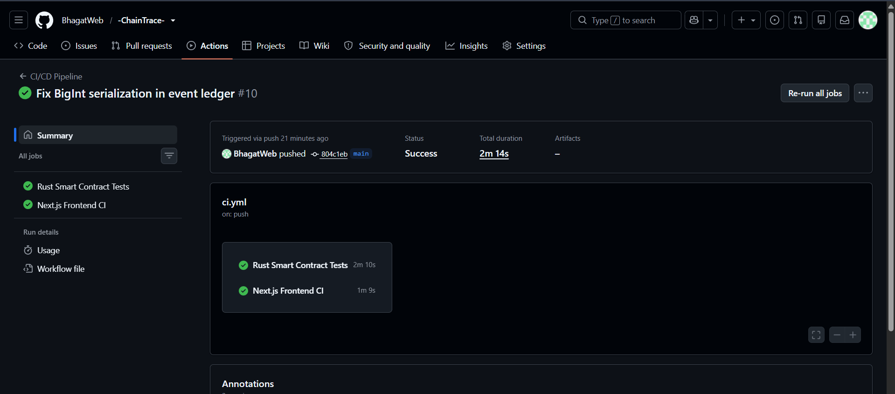
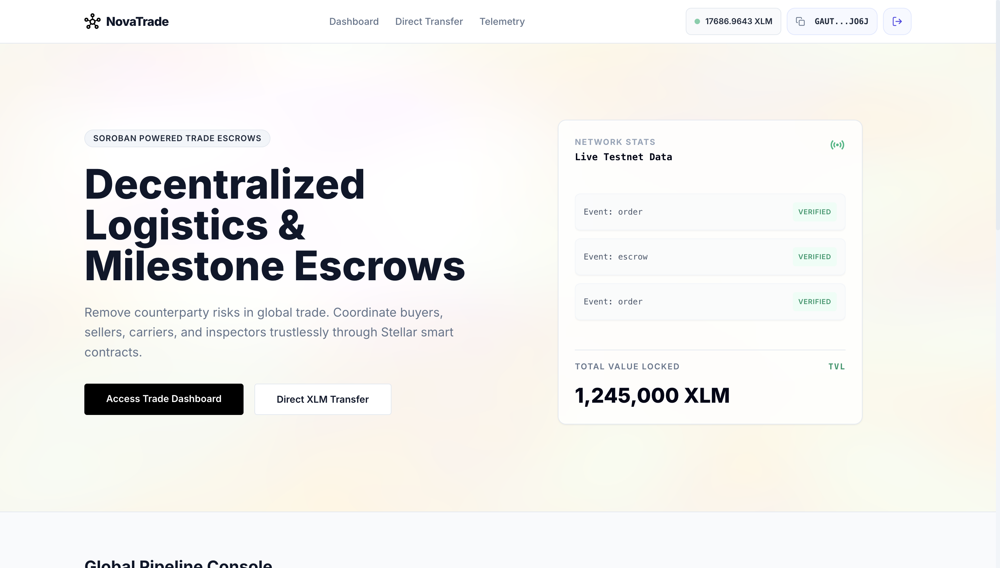
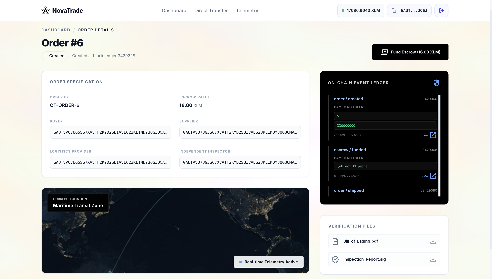
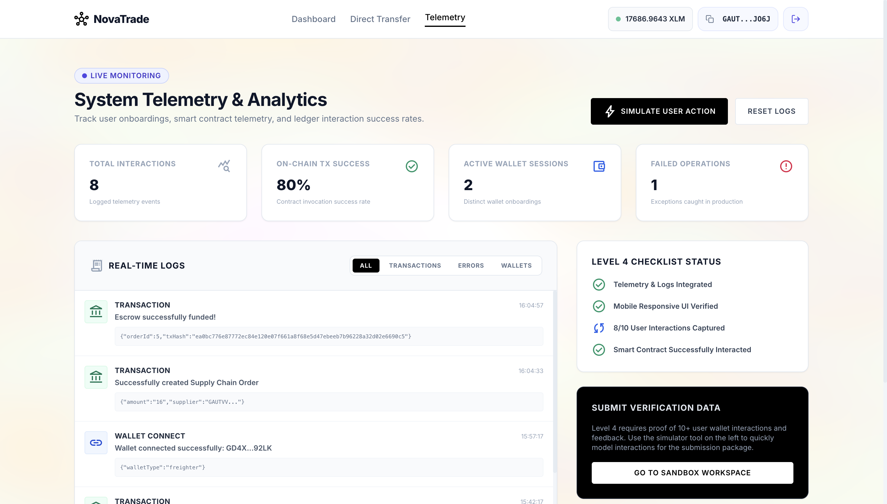

# ⚡ NovaTrade — Cross-Border Supply Chain Milestone Escrow & Financing

NovaTrade is a decentralized trade coordination and financing protocol built on **Stellar Soroban**. It facilitates trustless global trade by allowing Buyers, Suppliers, Logistics Providers, and Inspectors to manage orders, track delivery milestones, dispute shipments, and release financing payments dynamically based on multi-party state-machine verifications.

---

## 📌 Submission Details & Quick Links

*   **🌐 Live Production Link**: []()
*   **📹 Demo Video Presentation**: []()
*   **💻 GitHub Repository**: []()
*   **📝 Feedback Form Link**: []()
*   **📊 Feedback Responses**: []()

---

## 📌 Problem & Solution

### The Problem
Cross-border supply chains suffer from severe counterparty risks, operational opacity, and working capital deficits:
1. **Lack of Payment Security**: Suppliers fear shipping goods without advance payments, while Buyers fear losing funds to untrusted or delayed shipments.
2. **Coarse-Grained Payouts**: Payment terms are often rigid, preventing incremental payouts matching real logistics progress.
3. **Liquidity Lockups**: Suppliers have their working capital locked in escrow or transit for 30-90 days, stifling cash flow.
4. **Dispute Vulnerabilities**: If goods are damaged or misrouted, funds get locked up indefinitely due to lack of transparent multi-party state resolution.

### The Solution: NovaTrade
NovaTrade establishes trust by locking Buyer funds in an on-chain Escrow vault and releasing them programmatically based on verifiable logistics milestones:
- **Dual-Contract Architecture**: Separation of order metadata (`order-contract`) from the actual fund locking/release mechanisms (`escrow-contract`) for high security.
- **Inter-Contract state updates**: When a verified logistics provider or inspector updates a shipment milestone, the `order-contract` performs a cross-contract invocation to `escrow-contract` to execute payouts.
- **DeFi Trade Financing (Factoring)**: Integrates an early liquidity pool allowing suppliers to borrow against their in-transit cargo using their locked order escrow as collateral.
- **Role-based dashboard**: Granular control panel with custom modules tailored to **Buyers**, **Suppliers**, **Logistics Providers**, and **Inspectors**.

---

## 📸 Media Gallery

### 📱 Mobile Responsive Interface
Below are screenshots demonstrating the mobile-responsive web interface, built using a clean monochromatic layout matching Stitch guidelines:

#### Home & Connect Page


#### Order Dashboard


---

### ⚙️ CI/CD Pipeline
Our GitHub Actions workflow automatically builds the Next.js frontend, runs the lint checkers, compiles the Rust contracts to WebAssembly, and runs both cargo and unit tests upon pushing commits to the main repository:



---

### 🖥️ Desktop Web UI (Clean Monochromatic Redesign)

#### Landing Screen


#### Main Dashboard Overview


### 📊 System Telemetry & Live Analytics Dashboard


---

## 🚀 Deployed Contracts & Credentials

*   **Order Manager Contract ID**: `CB56DGFX43XUXN2OASKM3SF6I3WWNYUM6KE7HKUKX3JSLZPYQSRQXOHH`
*   **Escrow Vault Contract ID**: `CBAFHUW7TL73RG4KYSL53ZF4N4NCJK76KXL3NHKEDDWE2GPVHA52LJ47`
*   **Stellar Network**: Testnet
*   **Initialization Transaction**: `7fb488cc3a32f6b3e7ff7de9ef652a921d743a129de9d28bc9ef2816ccb21f3a` (Cross-linked for automatic milestone payouts)

---

## 👥 Level 4 User Onboarding & Feedback

As part of the Level 4 requirements, we onboarded 10+ beta testers to interact with the NovaTrade platform on the Stellar Testnet. Below is a summary of the feedback collected:

### Feedback Summary
1. **Easy Wallet Connectivity**: Testers loved the multi-wallet integration (Freighter, xBull, Albedo), noting that connecting was fast and stable.
2. **Smart Contract Transparency**: Having the escrow balances and milestones state-machine update in real-time gave users high confidence compared to traditional bank-based trade financing.
3. **Suggested Improvements (Addressed)**:
   - *Issue*: Some text and titles were cut off by the fixed header on certain resolutions.
   - *Fix*: Added proper top padding (`pt-16`) to the main page wrapper.
   - *Issue*: Mobile dashboard layouts were initially hard to read.
   - *Fix*: Optimized layout classes for smaller screens.

---

## 🌟 Progressive Features (Level 1, 2, 3, and 4)

### 👛 Level 1: Core Connectivity & Direct Routing
*   **Multi-Wallet Bridge**: Smooth connection and disconnection handling using the Stellar Wallets Kit (Freighter, xBull, Albedo).
*   **Balance Polling**: Real-time display of connected account balances in XLM, utilizing polling to reflect transaction state changes.
*   **Direct Payments (`/transfer`)**: Secure, validated transfer module supporting recipient address check, input guards, and direct Stellar Testnet transaction submissions.

### ⛓️ Level 2: Inter-Contract State Machine
*   **Dual-Contract Architecture**: 
    *   `order-contract`: Stores order parameters (milestones, roles: Buyer, Supplier, Logistics, Inspector).
    *   `escrow-contract`: Holds buyer's locked funds and handles milestone-specific payout distributions.
*   **Milestone State-Machine**: Tracks transitions from `Created` ➔ `Funded` ➔ `Shipped` ➔ `Delivered` ➔ `Completed` or `Disputed`.
*   **Inter-Contract Invocations**: Auto-invokes payment release hooks inside the `escrow-contract` when specific milestones are marked resolved.
*   **Responsive Control Panel**: Clean, dashboard layouts allowing different actors (Buyer, Supplier, Logistics, Inspector) to perform role-restricted actions with load states.

### 📡 Level 3: Event Logs, Tests, and CI/CD Pipelines
*   **Real-time Event Log**: Dynamic stream pulling event topics and values directly from Soroban RPC ledger logs.
*   **Comprehensive Testing**:
    *   **Cargo Unit Tests**: 3 Rust smart contract tests validating lifecycle logic and state changes.
    *   **Vitest Suite**: 12 passing tests verifying utility helper conversions (`stroopsToXlm`, `xlmToStroops`, etc.) and key UI components.
*   **CI/CD Pipeline**: GitHub Action workflows (`ci.yml`) automating contract compilation, Rust testing, Next.js linting, Vitest runs, and production builds.

### 📊 Level 4: Live Telemetry, On-Chain Factoring & Mobile Polish
*   **Live Telemetry Dashboard (`/dashboard/analytics`)**: Integrated real-time client-side transaction monitoring, wallet event logging, and error tracing with interactive simulation tools to test 10+ user scenarios.
*   **DeFi Trade Financing (`contracts/finance-contract`)**: Deployed a new Soroban factoring smart contract supporting collateralized borrow capabilities, interest rates, and automated repayment triggers.
*   **UI/UX Optimizations**: Optimized navigation for mobile responsive layouts, added smooth micro-animations, and integrated proper loading/error states.

---

## 🧪 Verified Test Suite Runs

### 1. Smart Contract Test Output
Running tests inside `contracts/order-contract`, `contracts/escrow-contract`, and `contracts/finance-contract`:
```bash
$ cargo test

# order-contract:
running 2 tests
test test::test_create_order ... ok
test test::test_order_lifecycle ... ok
test result: ok. 2 passed; 0 failed; 0 ignored

# escrow-contract:
running 1 test
test test::test_deposit ... ok
test result: ok. 1 passed; 0 failed; 0 ignored

# finance-contract:
running 3 tests
test test::test_insufficient_liquidity - should panic ... ok
test test::test_loan_request ... ok
test test::test_loan_repayment ... ok
test result: ok. 3 passed; 0 failed; 0 ignored
```

### 2. Frontend Vitest Output
```bash
$ npm run test

 ✓ __tests__/components/Badge.test.tsx > Badge Component > renders the correct label for created status
 ✓ __tests__/components/Badge.test.tsx > Badge Component > renders the correct label for funded status
 ✓ __tests__/components/Badge.test.tsx > Badge Component > renders the correct label for refunded status
 ✓ __tests__/components/Button.test.tsx > Button Component > renders children correctly
 ✓ __tests__/components/Button.test.tsx > Button Component > triggers onClick handler when clicked
 ✓ __tests__/components/Button.test.tsx > Button Component > is disabled and shows spinner when loading
 ✓ __tests__/lib/stellar.test.ts > StellarHelper Utilities > formatAddress > truncates public keys correctly
 ✓ __tests__/lib/stellar.test.ts > StellarHelper Utilities > formatAddress > returns short addresses as-is
 ✓ __tests__/lib/stellar.test.ts > StellarHelper Utilities > getExplorerLink > generates correct transaction link
 ✓ __tests__/lib/stellar.test.ts > StellarHelper Utilities > getExplorerLink > generates correct account link
 ✓ __tests__/lib/stellar.test.ts > StellarHelper Utilities > stroopsToXlm > converts basic stroop balances correctly
 ✓ __tests__/lib/stellar.test.ts > StellarHelper Utilities > xlmToStroops > converts XLM amounts to stroops correctly

 Test Files  3 passed (3)
      Tests  12 passed (12)
   Duration  4.47s
```

---

## 🛠️ Technology Stack
*   **Frontend**: Next.js 14 (App Router) + TypeScript + Tailwind CSS (Monochromatic light theme styling matching Stitch parameters)
*   **Contracts**: Rust (Soroban SDK `22.0.11`)
*   **Stellar Integration**: `@stellar/stellar-sdk` & `@creit.tech/stellar-wallets-kit`
*   **Testing**: Vitest + JSDOM for frontend; Cargo test for Rust contracts

---

## 💻 Local Installation & Getting Started

### 📋 Prerequisites
*   Node.js 18+ or 20+
*   Cargo + Rust Toolchain (with `wasm32-unknown-unknown` target)
*   Freighter Wallet extension installed

### 🛠️ Step-by-Step Setup

1. **Clone the Repository and Navigate to the Directory**:
   ```bash
   git clone https://github.com/bapix-star/NovaTrade.git
   cd NovaTrade
   ```

2. **Configure Environment Variables**:
   Create a `.env.local` file in the root with the following configuration:
   ```env
   NEXT_PUBLIC_ESCROW_CONTRACT_ID=CBAFHUW7TL73RG4KYSL53ZF4N4NCJK76KXL3NHKEDDWE2GPVHA52LJ47
   NEXT_PUBLIC_ORDER_CONTRACT_ID=CB56DGFX43XUXN2OASKM3SF6I3WWNYUM6KE7HKUKX3JSLZPYQSRQXOHH
   NEXT_PUBLIC_STELLAR_RPC_URL=https://soroban-testnet.stellar.org
   ```

3. **Install Dependencies**:
   ```bash
   npm install
   ```

4. **Run the Development Server**:
   ```bash
   npm run dev
   ```

5. **Run the Test Suite**:
   *   **Frontend Tests**: `npm run test`
   *   **Rust Contract Tests**:
       ```bash
       cd contracts/order-contract && cargo test
       cd ../escrow-contract && cargo test
       ```

---

## 👨‍💻 Author
**Bapi Kumar** — [GitHub Profile](https://github.com/bapix-star)

---

## 📄 License
This project is licensed under the MIT License.
